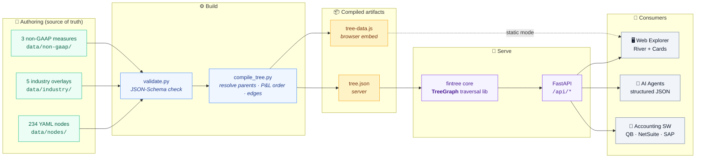
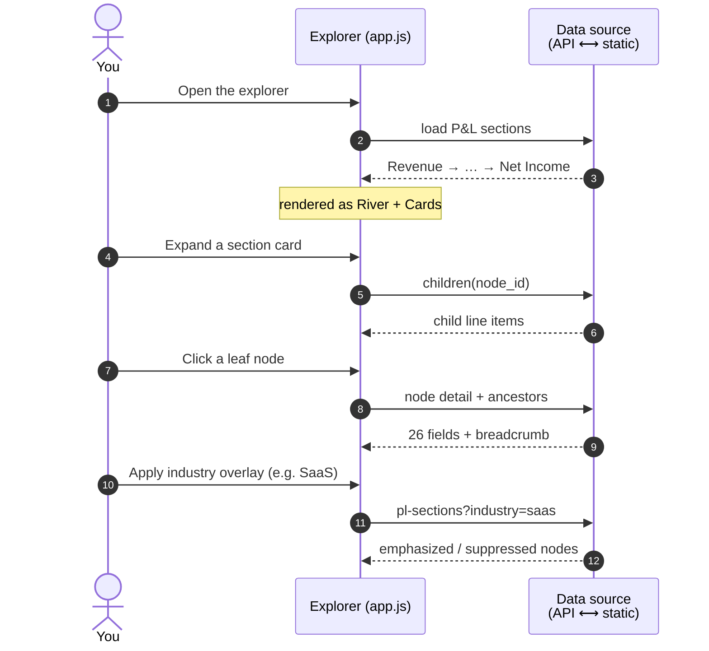
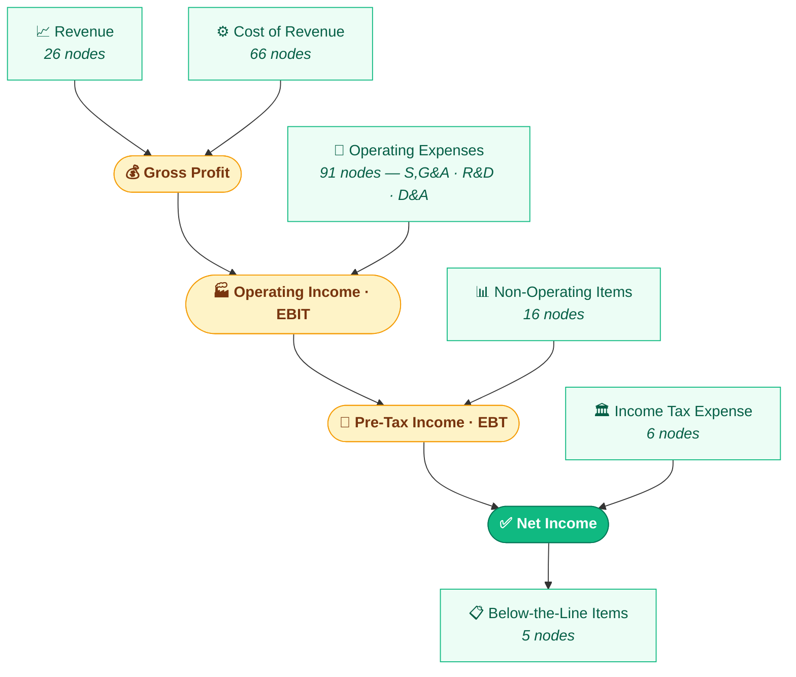

<p align="center">
  <strong>FinTree</strong><br>
  <em>Canonical GAAP P&L Ontology for Humans and AI Agents</em>
</p>

<p align="center">
  <a href="https://github.com/gtm-k/fintree/blob/main/LICENSE"></a>
  
  
  
  
  
</p>

---

A structured, machine-readable P&L (income statement) hierarchy tree covering 234 US GAAP line items. Every node includes XBRL tags, ASC references, variance driver playbooks, real-company comparability examples, and chart-of-accounts mappings.

Built for FP&A teams, AI financial agents, and accounting software integrations.

## Features

- **234 P&L nodes** organized in a hierarchical tree from Net Income down to granular line items
- **XBRL mapped** to real US GAAP taxonomy tags verified against SEC EDGAR
- **5 industry overlays** (SaaS, Manufacturing, Retail, Financial Services, Professional Services)
- **Variance driver playbooks** with specific increase/decrease root causes per line item
- **Real company comparability** examples (Apple, Salesforce, Amazon, McDonald's, etc.)
- **Chart of Accounts mappings** for QuickBooks, NetSuite, and SAP
- **AI context tags** for semantic search and agent consumption
- **Interactive web explorer** with responsive mobile design
- **RESTful API** for programmatic access

## How It Works

FinTree is authored as plain YAML, compiled into a single tree, and served two ways — as a live API or as a fully static site (GitHub Pages) with the data embedded in the page.



## Quick Start

```bash
# Clone
git clone https://github.com/gtm-k/fintree.git
cd fintree

# Install
pip install -e packages/core
pip install -e packages/api

# Run
cd packages/api
uvicorn fintree_api.main:app --port 8000

# Open http://localhost:8000
```

## Exploring the Tree

The web explorer renders the tree as a **River + Cards** P&L statement. The same UI talks to either the live API or the embedded static data — so it works identically when hosted on GitHub Pages with no backend.



## API

| Endpoint | Description |
|---|---|
| `GET /api/tree/stats` | Tree statistics (node counts, levels) |
| `GET /api/tree/pl-sections` | P&L sections in financial statement order |
| `GET /api/tree/full` | Complete tree with all nodes and edges |
| `GET /api/nodes/detail?id=fintree:NetIncome` | Full node detail (26 fields) |
| `GET /api/nodes/ancestors?id=...` | Breadcrumb ancestor chain |
| `GET /api/nodes/children?id=...` | Direct children of a node |
| `GET /api/search?q=revenue` | Fuzzy search across all nodes |
| `GET /api/industry` | Available industry overlays |
| `GET /api/tree/pl-sections?industry=saas` | P&L with SaaS overlay applied |

## Tree Structure

Displayed in financial-statement order (SEC Regulation S-X, Rule 5-03): **Revenue at the top flowing down to Net Income**. Gold rows are computed subtotals, not data nodes.



> The data model is a **tree rooted at Net Income** (values aggregate upward); the statement above is its top-down *presentation*. The full hierarchy with every sub-line:

```
Net Income
├── Pre-Tax Income (EBT)
│   ├── Operating Income (EBIT)
│   │   ├── Gross Profit
│   │   │   ├── Net Revenue (26 nodes)
│   │   │   └── Cost of Revenue (66 nodes)
│   │   └── Operating Expenses (91 nodes)
│   │       ├── Selling Expenses
│   │       ├── G&A Expenses
│   │       ├── R&D Expenses
│   │       └── Depreciation & Amortization
│   └── Non-Operating Income & Expenses (16 nodes)
├── Income Tax Expense (6 nodes)
└── Below-the-Line Items (5 nodes)
```

## Node Data

Each of the 234 nodes includes:

| Field | Example |
|---|---|
| `id` | `fintree:ProductRevenue` |
| `xbrl_tag` | `us-gaap:RevenueFromContractWithCustomerExcludingAssessedTax` |
| `definition` | Revenue from the sale of physical goods |
| `formula_human` | Finished Goods + Component Sales + Licensing |
| `asc_reference` | ASC 606 |
| `normal_balance` | CREDIT |
| `variance_drivers` | Volume, pricing, mix, seasonal drivers with playbooks |
| `comparability` | Apple: "Products (iPhone, Mac, iPad, Wearables)" |
| `coa_mapping` | QB: 4100, NetSuite: 4100, SAP: 8100000 |
| `ai_context_tags` | `[revenue, product, asc_606, top_line]` |

## Project Structure

```
packages/
├── core/          # TreeGraph library (pip installable)
├── api/           # FastAPI server
├── data/
│   ├── nodes/     # 234 YAML node definitions
│   ├── industry/  # 5 industry overlay configs
│   ├── non-gaap/  # Non-GAAP measure definitions
│   ├── tree.json  # Compiled tree (generated)
│   └── scripts/   # Compiler and validator
└── web/
    └── static/    # Interactive frontend (HTML/CSS/JS)
```

## Industry Overlays

Apply an overlay to emphasize relevant nodes and suppress irrelevant ones:

| Overlay | Emphasized | Suppressed |
|---|---|---|
| SaaS | Subscription Revenue, Cloud Hosting, R&D | Direct Materials, Manufacturing Overhead |
| Manufacturing | Direct Labor, Raw Materials, Factory Costs | Cloud Compute, Subscription Revenue |
| Retail | Product Revenue, Inventory, Shipping | R&D, Cloud Infrastructure |
| Financial Services | Interest Income/Expense, Trading | Manufacturing, Inventory |
| Professional Services | Billable Labor, Utilization | Manufacturing, Inventory |

## License

[Apache 2.0](LICENSE)
